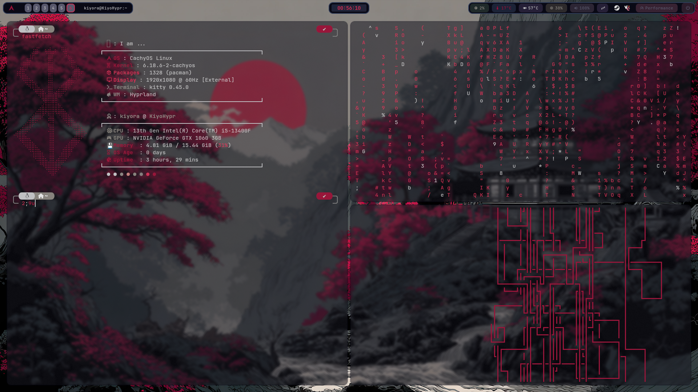
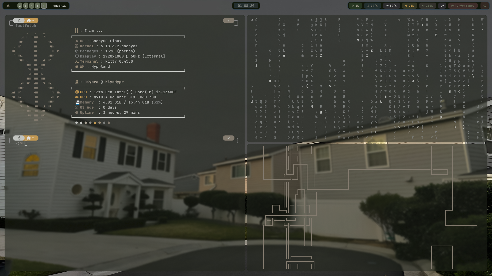
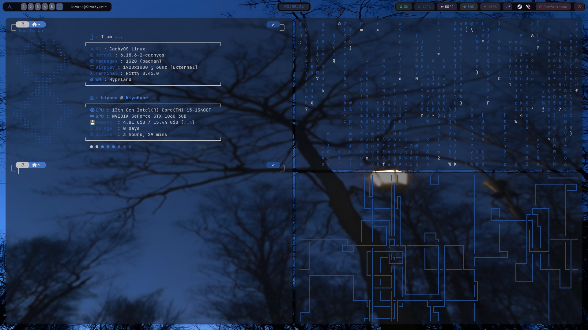
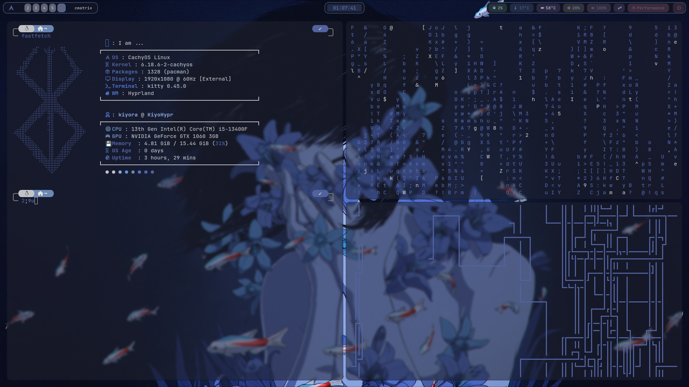
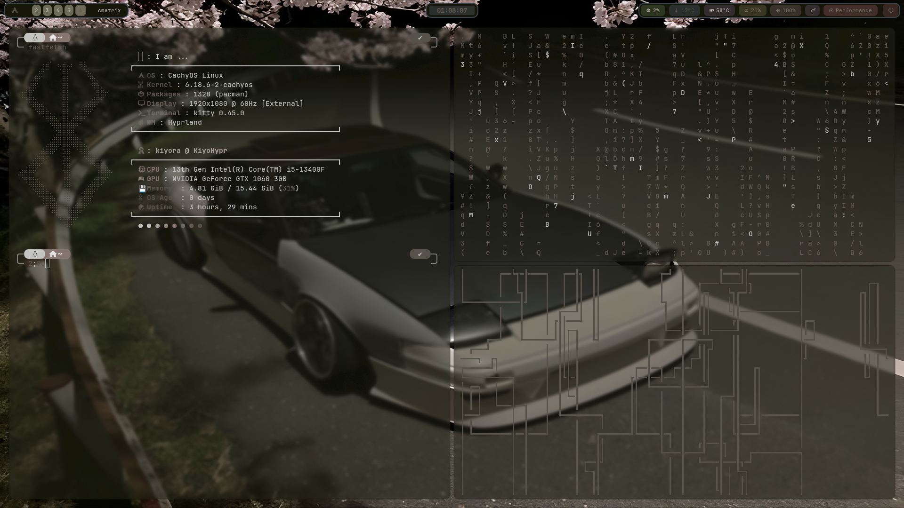

### 🩸 HateME Dots 

Minimalistic, aesthetic **dotfiles for Hyprland (Wayland)**, focused on workflow, performance, and a slightly dark, stylish vibe.  
Designed for a **modern look**, smooth animations, and practical tools for daily use.

> ⚠️ These dotfiles are primarily intended for **Arch Linux** and its derivatives.

---

## ✨ Features

- 🪟 **Hyprland** – dynamic Wayland compositor  
- 🎨 **Pywal16** – automatic color schemes based on your wallpaper  
- 📊 **Waybar** – clean and aesthetic panel  
- 🔔 **Mako** – lightweight notification daemon  
- 🖥️ **Kitty** – fast terminal with Nerd Fonts support  
- 🚀 **Wofi / Rofi** – application launchers  
- 📸 **Hyprshot** – screenshot tool  
- 🎧 **Spotify, Vesktop, Steam** – ready-to-use configurations  
- 🌌 Cohesive style, animations, and keyboard shortcuts  


---

## 🖼️ Screenshots







## ⚡ Installation Guide

Backup your current dotfiles (always recommended):
1. Make a backup of your config. ## Skip if u have newly installed system.
```bash
cp -r ~/.config ~/.config_backup
```

2. Make a backup of your config and Update the system.
```bash
sudo pacman -Syu
```

3. Clone the repository
```bash
git clone https://github.com/kwartoKiyo/hateme-dots.git ~/.config/hateme-dots
```

4. Install dependencies (see above).
 Pacman
```bash
sudo pacman -S hyprland kitty wofi rofi obs-studio zen-browser heroic-games-launcher waybar mako zsh dolphin ttf-jetbrains-mono ttf-jetbrains-mono-nerd swww hyprshot yay vesktop steam thunar btop cava
```
AUR
```bash
yay -S python-pywal16 spotify cmatrix-git
```
5. Link or copy configuration files to ~/.config:
```bash
cd ~/.config/hateme-dots/.config
```
```bash
cp -r * ~/.config
```
```bash
cd ~/.config/hateme-dots
```
```bash
cp -r * ~/
```

6.Create a wal color configuration
Random wallpaper 
```bash
wall -i ~/.config/wallpapers/abstract.jpg 
```
7. Reload a hyprland config and use.
```bash
hyprctl reload
```

***Enjoy your Hyprland rice!***

## 🎨 Customization Tips

Feel free to tweak the configuration files in the **~/.config** directory to suit your preferences.

Wallpaper & Colors: Change wallpaper and run:
##wal16 -i /path/to/wallpaper
```bash
wal16 -i ~/.config/wallpapers/chooseyourwallpaper

```

to update the color palette automatically.

Waybar Modules: Check **~/.config/waybar/config** to add/remove widgets.

Launchers: Configure Wofi/Rofi themes in **~/.config/rofi** and **~/.config/wofi**.

Notifications: Customize Mako in **~/.config/mako/config**.

## 📝 Tips & Tricks

Keyboard Shortcuts: Check **~/.config/hypr/configs/keybindings.conf** for all keybindings. Customize them to fit your workflow.

Performance: Wayland compositors are lightweight, but closing unused background apps helps.

Theme Consistency: Use Pywal16 to sync colors across terminal, Waybar, Wofi/Rofi, and Mako.

> ⚠️ Troubleshooting:
If something breaks, run:
```bash
hyprctl restart
```
or restore your backup dotfiles.
